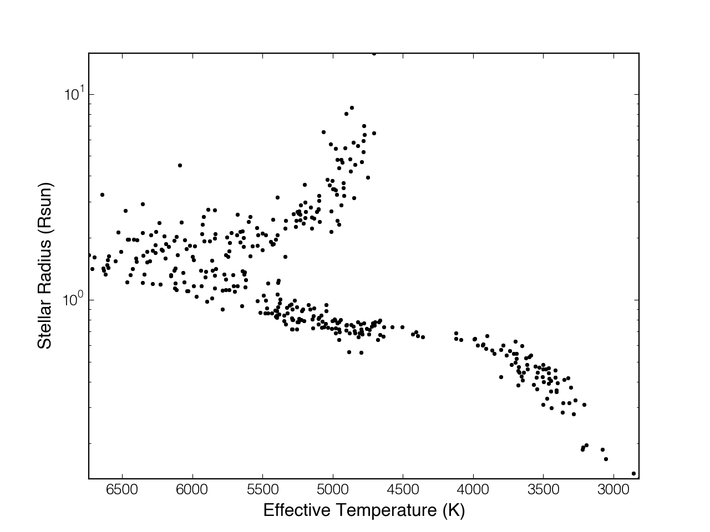

.. _quickstart:

Quickstart
==========

Here's how to get up and running with ``specmatch-emp`` 

Library
-------

``specmatch-emp`` comes with a large library high-resolution optical
spectra shifted onto the rest wavelength scale. We'll import the
library, along with some other useful modules.

.. literalinclude:: quickstart.py
   :start-after: code-start-imports
   :end-before: code-stop-imports

Now we'll load in the library around the Mgb triplet. By default,
SpecMatch create the following directory ``${HOME}/.specmatchemp/`` and
download the library into it.

.. literalinclude:: quickstart.py
   :start-after: code-start-loadlibrary
   :end-before: code-stop-loadlibrary

Here's how the library spans the HR diagram.

.. literalinclude:: quickstart.py
   :start-after: code-start-library
   :end-before: code-stop-library

And here's the library with the sources labeled.

.. literalinclude:: quickstart.py
   :start-after: code-start-library-labeled
   :end-before: code-stop-library-labeled

.. image:: quickstart-library-labeled.png

The parameters are stored in a pandas DataFrame which makes querying
easy. Let's grab some representative dwarf star spectra.

.. literalinclude:: quickstart.py
   :start-after: code-start-library-selected-stars
   :end-before: code-start-library-selected-stars

.. image:: quickstart-library-selected-stars.png

Plot the Mgb region for the spectra sorted by effective temperature

.. literalinclude:: quickstart.py
   :start-after: code-start-spectra-selected-stars
   :end-before: code-stop-spectra-selected-stars

.. image:: quickstart-spectra-selected-stars.png

Matching
--------

To see how to perform a match with SpecMatch, we will look at how to
perform the matching on two example stars - HD 190406, a G0V star, as
well as Barnard's Star (GL 699), an M dwarf.

This time, we import the library module with spectra from 5300-5400 A.
We obtain our two target spectra from the library and remove them from
the library as a test of our matching process.

.. literalinclude:: quickstart.py
   :start-after: code-start-specmatch-load
   :end-before: code-stop-specmatch-load

To perform SpecMatch, we import the specmatch module and create a 
SpecMatch object, then run SpecMatch.match().

The match method first compares the target spectrum against each of
the library spectra. It then synthesizes linear combinations of the
best matching spectra, using the respective weights to generate
the target parameters.

.. literalinclude:: quickstart.py
   :start-after: code-start-specmatch-match
   :end-before: code-stop-specmatch-match    
    

The final derived parameters can be found in the results attribute.

.. literalinclude:: quickstart.py
   :start-after: code-start-specmatch-print
   :end-before: code-stop-specmatch-print 

::

    Derived Parameters: 
    Teff: 5855, Radius: 1.36, [Fe/H]: 0.06
    Library Parameters: 
    Teff: 5763, Radius: 1.12, [Fe/H]: 0.03

We can take a closer look at the workings of the matching process. First,
examine the chi-squared surfaces of the match with the library spectra, 
to see that the best matches do indeed come from stars with similar parameters.

.. literalinclude:: quickstart.py
   :start-after: code-start-plot-chisquared
   :end-before: code-stop-plot-chisquared

.. image:: quickstart-Gstar-chisquared-surface.png

The 5 closest matches, which were used to synthesize the linear combinations,
have been highlighted. We can plot the position of these stars in the HR 
diagram together with the coefficients found in the linear combination step.

.. literalinclude:: quickstart.py
   :start-after: code-start-plot-references
   :end-before: code-stop-plot-references

.. image:: quickstart-Gstar-lincomb-references.png
