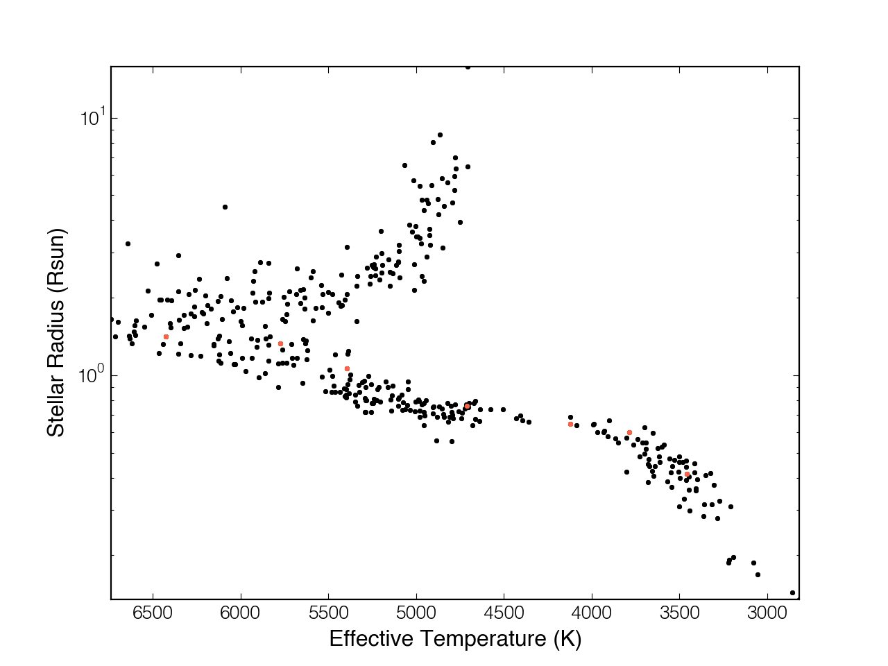
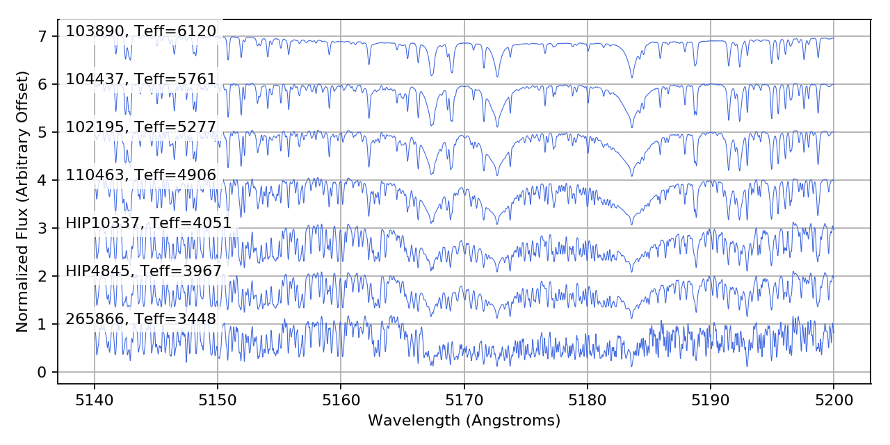

.. _quickstart:

Quickstart
==========

Here's how to get up and running with ``specmatch-emp`` 

Library
-------

``specmatch-emp`` comes with a large library high-resolution optical
spectra shifted onto the rest wavelength scale. We'll import the
library, along with some other useful modules.

.. literalinclude:: quickstart.py
   :start-after: code-start-imports
   :end-before: code-stop-imports

Now we'll load in the library around the Mgb triplet. By default,
SpecMatch create the following directory ``${HOME}/.specmatchemp/`` and
download the library into it.

.. literalinclude:: quickstart.py
   :start-after: code-start-loadlibrary
   :end-before: code-stop-loadlibrary

Here's how the library spans the HR diagram.

.. literalinclude:: quickstart.py
   :start-after: code-start-library
   :end-before: code-stop-library

.. image:: quickstart-library.png

And here's the library with the sources labeled.

.. literalinclude:: quickstart.py
   :start-after: code-start-library-labeled
   :end-before: code-stop-library-labeled

.. image:: quickstart-library-labeled.png

The parameters are stored in a pandas DataFrame which makes querying
easy. Let's grab some representative dwarf star spectra.

.. literalinclude:: quickstart.py
   :start-after: code-start-library-selected-stars
   :end-before: code-start-library-selected-stars

Plot the Mgb region for the spectra sorted by effective temperature

.. literalinclude:: quickstart.py
   :start-after: code-start-spectra-selected-stars
   :end-before: code-stop-spectra-selected-stars

Matching
--------

To see how to perform a match with SpecMatch, we will look at how to
perform the matching on two example stars - HD 190406, a G0V star, as
well as Barnard's Star (GL 699), an M dwarf.

Once again, we import the library module and read in the library. We
obtain our two target spectra from the library and remove them from
the matching process.

::

    import specmatchemp.library
    lib = specmatchemp.library.read_hdf()
    
    idx1 = lib.get_index('190406')
    G_star = lib.pop(idx1)
    idx2 = lib.get_index('GL699')
    M_star = lib.pop(idx2)

To perform SpecMatch, we import the specmatch module and create a 
SpecMatch object. As an example, we will use the wavelength region
from 5300 - 5400 Angstroms.

The match method first compares the target spectrum against each of
the library spectra. It then synthesizes linear combinations of the
best matching spectra.

::
    
    from specmatchemp.specmatch import SpecMatch
    match_G = SpecMatch(G_star[1], lib, (5300,5400))
    match_G.match()

The final derived parameters can be found in the results attribute.

::

    print('Derived Parameters: ')
    print('Teff: {0:.0f}, Radius: {1:.2f}, [Fe/H]: {2:.2f}'.format(\
            match_G.results['Teff'], match_G.results['radius'], match_G.results['feh']))
    print('Library Parameters: ')
    print('Teff: {0:.0f}, Radius: {1:.2f}, [Fe/H]: {2:.2f}'.format(\
            G_star[0]['Teff'], G_star[0]['radius'], G_star[0]['feh']))

::

    Derived Parameters: 
    Teff: 5855, Radius: 1.36, [Fe/H]: 0.06
    Library Parameters: 
    Teff: 5763, Radius: 1.12, [Fe/H]: 0.03

We can take a closer look at the workings of the matching process. First,
examine the chi-squared surfaces of the match with the library spectra, as
a function of stellar parameters.

::

    fig = figure(figsize=(12,8))
    match_G.plot_chi_squared_surface()
    # Indicate library parameters for target star.
    fig.add_subplot(131)
    axvline(x=G_star[0].Teff, color='k')
    fig.add_subplot(132)
    axvline(x=G_star[0].radius, color='k')
    fig.add_subplot(133)
    axvline(x=G_star[0].feh, color='k')

.. image:: quickstart-Gstar-chisquared-surface.png

The 5 closest matches, which were used to synthesize the linear combinations,
have been highlighted. The position of these stars in the HR-diagram can be
seen below.

::

    match_G.plot_references()
