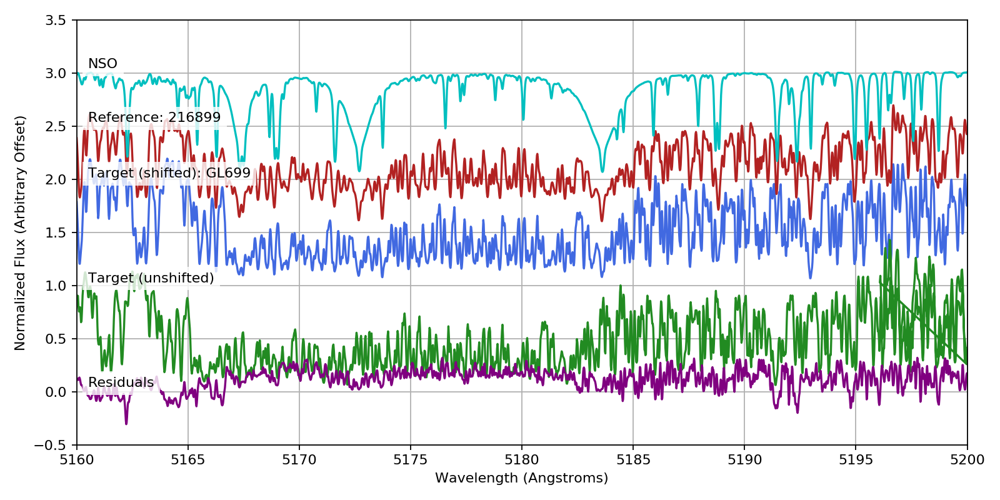

.. _quickstart:

Quickstart
==========

Here's how to get up and running with ``specmatch-emp`` 

Library
-------

``specmatch-emp`` comes with a large library high-resolution optical
spectra shifted onto the rest wavelength scale. We'll import the
library, along with some other useful modules.

.. literalinclude:: quickstart.py
   :start-after: code-start-imports
   :end-before: code-stop-imports

Now we'll load in the library around the Mgb triplet. By default,
SpecMatch create the following directory ``${HOME}/.specmatchemp/`` and
download the library into it.

.. literalinclude:: quickstart.py
   :start-after: code-start-loadlibrary
   :end-before: code-stop-loadlibrary

Here's how the library spans the HR diagram.

.. literalinclude:: quickstart.py
   :start-after: code-start-library
   :end-before: code-stop-library

.. image:: quickstart-library.png

And here's the library with the sources labeled.

.. literalinclude:: quickstart.py
   :start-after: code-start-library-labeled
   :end-before: code-stop-library-labeled

.. image:: quickstart-library-labeled.png

The parameters are stored in a pandas DataFrame which makes querying
easy. Let's grab some representative dwarf star spectra.

.. literalinclude:: quickstart.py
   :start-after: code-start-library-selected-stars
   :end-before: code-stop-library-selected-stars

.. image:: quickstart-library-selected-stars.png

Plot the Mgb region for the spectra sorted by effective temperature

.. literalinclude:: quickstart.py
   :start-after: code-start-spectra-selected-stars
   :end-before: code-stop-spectra-selected-stars

.. image:: quickstart-spectra-selected-stars.png

Shifting
--------

In the rest of this document, we will look at two example stars:
HD 190406 (spectral class G0V), and Barnard's star (GL 699), an M dwarf.
Both of these stars are already in our library, so we will remove them
from the library.

.. literalinclude:: quickstart.py 
   :start-after: code-start-pop-library
   :end-before: code-stop-pop-library

To begin using SpecMatch, we first load in a spectrum and shift it onto
the library wavelength scale. The raw HIRES spectra have been provided in
the samples folder. 

We read in the spectrum of HD 190406, in the same wavelength region as the
library.

.. literalinclude:: quickstart.py 
   :start-after: code-start-read-spectrum-G
   :end-before: code-stop-read-spectrum-G

To shift the spectrum, we create the SpecMatch object and run shift().

This method runs a cross-correlation between the target spectrum and
several reference spectra in the library for a select region of the
spectrum. The reference spectrum which gives the largest cross-correlation
peak is then used to shift the entire spectrum.

.. literalinclude:: quickstart.py
   :start-after: code-start-shift-spectrum-G
   :end-before: code-stop-shift-spectrum-G

We can see the results of the shifting process. In this case, the code
chose to use the NSO spectrum as the reference. We make use of the
`spectrum.Spectrum.plot()` method to quickly plot each of the
unshifted, shifted and reference spectra. Note that HIRES has
overlapping orders so some spectral lines appear twice. In the final
resampled spectrum, the small segments of overlapping orders are
averaged.

.. literalinclude:: quickstart.py
   :start-after: code-start-plot-shifts-G
   :end-before: code-stop-plot-shifts-G

.. image:: quickstart-Gstar-shifts.png

We repeat the same process for the M star spectrum. In this case, we see
that the code chose to shift the spectrum to a different reference: HD216899,
which is another M dwarf in our library. We have used the convenience
function :meth:`SpecMatch.plot_shifted_spectrum` to easily plot
the shift results. 

.. literalinclude:: quickstart.py
   :start-after: code-start-shift-spectrum-M
   :end-before: code-stop-shift-spectrum-M

Matching
--------

Now, we can perform the match. We first run :meth:`SpecMatch.match`, which
performs a match between the target and every other star in the library,
allowing v sin i to float and fitting a spline to the continuum.

We can then plot the chi-squared surfaces to see where the best matches
lie in parameter space.

.. literalinclude:: quickstart.py
   :start-after: code-start-match-G
   :end-before: code-stop-match-G

.. image:: quickstart-Gstar-chisquared-surface.png

We see that the code does a good job in finding the library stars which
are close to parameter space to the target star.

Next, running :meth:`SpecMatch.lincomb()`, the code synthesizes linear
combinations of the best matching spectra to obtain an even better match
to the target. 

The respective coefficients will be used to form a weighted
average of the library parameters, which are taken to be the derived
properties of the target. These are stored in the results attribute.

.. literalinclude:: quickstart.py
   :start-after: code-start-lincomb-G
   :end-before: code-stop-lincomb-G

::

    Derived Parameters:
    Teff: 5844, Radius: 1.33, [Fe/H]: 0.04
    Library Parameters:
    Teff: 5763, Radius: 1.12, [Fe/H]: 0.03

We can take a closer look at the workings of this process by plotting
the positions of the best matching library stars in a HR diagram, as
well as their spectra.

.. literalinclude:: quickstart.py
   :start-after: code-start-plot-lincomb-G
   :end-before: code-stop-plot-lincomb-G

.. image:: quickstart-Gstar-lincomb-references.png

.. image:: quickstart-Gstar-lincomb-spectra.png

Finally, we can repeat the whole process with Barnard's star.

.. literalinclude:: quickstart.py
    :start-after: code-start-mstar
    :end-before: code-stop-mstar

::

    Derived Parameters:
    Teff: 3181, Radius: 0.19, [Fe/H]: -0.29
    Library Parameters:
    Teff: 3222, Radius: 0.19, [Fe/H]: -0.39

.. image:: quickstart-Mstar-chisquared-surface.png

.. image:: quickstart-Mstar-lincomb-references.png

.. image:: quickstart-Mstar-lincomb-spectra.png
